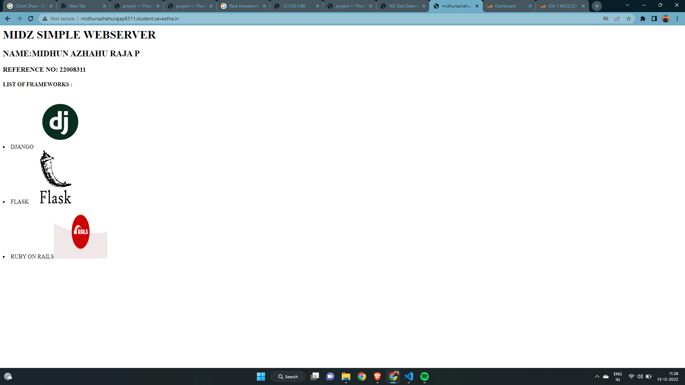

# Developing a Simple Webserver

# AIM:

NAME: MIDHUN AZHAHU RAJA P
REFERENCE NO : 22008311
# DESIGN STEPS:

## Step 1:

HTML content creation is done

## Step 2:

Design of webserver workflow

## Step 3:

Implementation using Python code

## Step 4:

Serving the HTML pages.

## Step 5:

Testing the webserver

# PROGRAM:
```
from http.server import HTTPServer, BaseHTTPRequestHandler

content ="""
<html>
<head>
</head>
<body>
<h1>MIDZ SIMPLE WEBSERVER</h1>
<h2>NAME:MIDHUN AZHAHU RAJA P</h2>
<h3>REFERENCE NO: 22008311</h3>
<h4>LIST OF FRAMEWORKS : </h4>
<u1>
<li>DJANGO</li>
<li>FLASK</li>
<li>RUBY ON RAILS</li>


</body>
</html>"""


class HelloHandler(BaseHTTPRequestHandler):  
     def do_GET(self):
          self.send_response(200)
          self.send_header("content-type","text/html;charset=utf-8")
          self.end_headers()
          self.wfile.write(content.encode())

server_address = ('',80)
httpd = HTTPServer(server_address,HelloHandler)
httpd.serve_forever()
```
# OUTPUT:



# RESULT:
The program is executed succesfully
